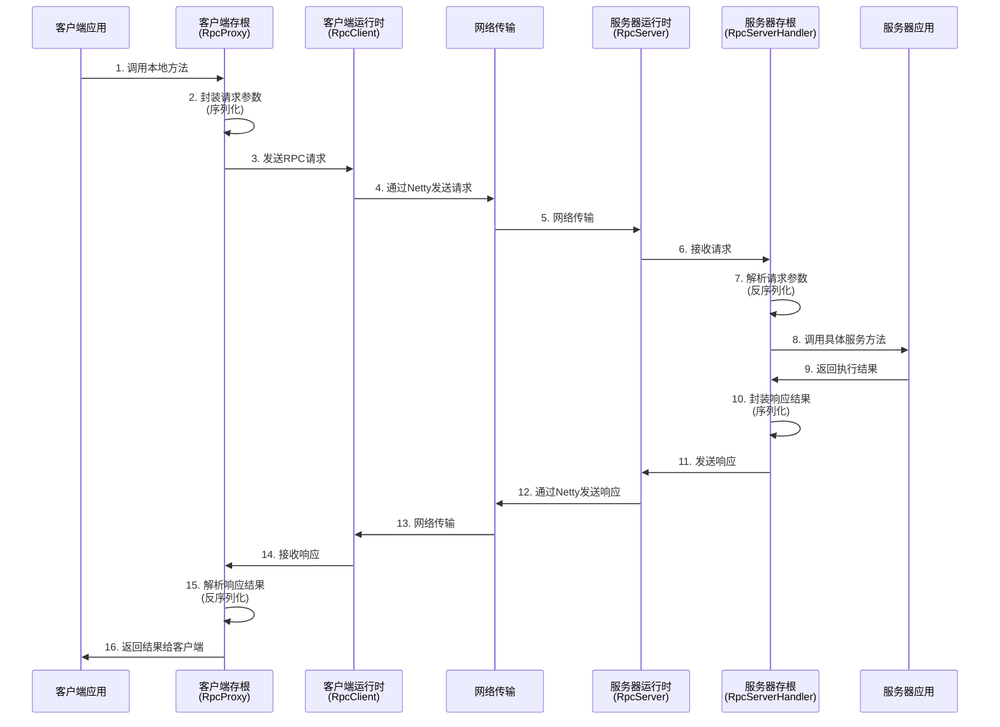

# RPC（远程过程调用）实现原理文档

## 目录

1. [RPC 概述](#1-rpc概述)
2. [系统架构](#2-系统架构)
3. [核心组件](#3-核心组件)
4. [工作流程](#4-工作流程)
5. [关键技术](#5-关键技术)
6. [项目结构](#6-项目结构)
7. [使用示例](#7-使用示例)
8. [总结](#8-总结)

---

## 1. RPC 概述

### 1.1 什么是 RPC？

RPC（Remote Procedure Call，远程过程调用）是一种分布式系统通信技术，它允许程序调用另一个地址空间（通常是另一台计算机上）的过程或函数，而不需要程序员显式编码这个远程调用的细节。

### 1.2 RPC 的优势

- **透明性**：调用远程服务就像调用本地方法一样简单
- **跨平台**：支持不同语言和平台之间的通信
- **高性能**：基于 Netty 实现高效的网络通信
- **易于使用**：通过注解和代理简化开发

### 1.3 核心原理

RPC 的核心思想是"像调用本地方法一样调用远程方法"。客户端通过代理对象发起调用，代理对象将方法调用转换为网络请求，发送到服务器端执行，然后将结果返回给客户端。

---

## 2. 系统架构

### 2.1 整体架构图

```
┌─────────────────────────────────────────────────────────────────────────────┐
│                              RPC系统架构                                        │
├─────────────────────────────────────────────────────────────────────────────┤
│                                                                             │
│  ┌─────────────────┐      ┌─────────────────┐      ┌─────────────────┐    │
│  │   客户端应用      │      │    网络传输层    │      │   服务器应用      │    │
│  │  (rpc-client)   │      │    (Netty)     │      │  (rpc-server)   │    │
│  └─────────────────┘      └─────────────────┘      └─────────────────┘    │
│           │                        │                        │             │
│  ┌─────────────────┐      ┌─────────────────┐      ┌─────────────────┐    │
│  │   RPC核心组件    │      │   协议编解码层   │      │   服务注册中心   │    │
│  │   (rpc-core)    │      │   序列化/反序列化 │      │   业务逻辑处理   │    │
│  └─────────────────┘      └─────────────────┘      └─────────────────┘    │
│           │                        │                        │             │
│  ┌─────────────────┐      ┌─────────────────┐      ┌─────────────────┐    │
│  │   公共组件       │      │                │      │                 │    │
│  │  (rpc-common)   │      │                │      │                 │    │
│  └─────────────────┘      └─────────────────┘      └─────────────────┘    │
│                                                                             │
└─────────────────────────────────────────────────────────────────────────────┘
```

### 2.2 分层结构

| 层次     | 模块                    | 职责               |
| -------- | ----------------------- | ------------------ |
| 应用层   | rpc-client / rpc-server | 业务逻辑处理       |
| 代理层   | RpcProxy                | 动态代理和方法拦截 |
| 传输层   | RpcClient / RpcServer   | 网络通信管理       |
| 协议层   | RpcEncoder / RpcDecoder | 消息编解码         |
| 序列化层 | JsonSerializer          | 对象序列化         |
| 公共层   | rpc-common              | 通用数据结构和注解 |

---

## 3. 核心组件

### 3.1 客户端组件

#### 3.1.1 RpcProxy（代理工厂）

```java
// 核心作用：创建远程服务的本地代理对象
public class RpcProxy implements InvocationHandler {
    // 拦截方法调用，转换为RPC请求
    public Object invoke(Object proxy, Method method, Object[] args) {
        // 1. 构建RPC请求对象
        // 2. 发送请求到服务器
        // 3. 等待响应并返回结果
    }
}
```

#### 3.1.2 RpcClient（客户端）

```java
// 核心作用：管理与服务器的连接和请求发送
public class RpcClient {
    // 基于Netty的异步网络通信
    private final ConcurrentMap<String, CompletableFuture<RpcResponse>> pendingRequests;

    // 发送RPC请求
    public CompletableFuture<RpcResponse> send(RpcRequest request) {
        // 异步发送请求并返回Future
    }
}
```

### 3.2 服务器组件

#### 3.2.1 RpcServer（服务器）

```java
// 核心作用：监听客户端请求，处理RPC调用
public class RpcServer {
    // 基于Netty的网络服务器
    public void start() throws InterruptedException {
        // 启动Netty服务器，监听指定端口
    }
}
```

#### 3.2.2 ServiceRegistry（服务注册表）

```java
// 核心作用：管理和查找服务实现
public class ServiceRegistry {
    // 注册服务实现
    public void registerService(String serviceName, Object serviceImpl) {
        // 将服务实现注册到本地注册表
    }

    // 查找服务实现
    public Object getService(String serviceName) {
        // 根据服务名查找对应的实现
    }
}
```

### 3.3 通信协议

#### 3.3.1 RpcRequest（请求对象）

```java
public class RpcRequest {
    private String requestId;      // 请求ID
    private String serviceName;    // 服务名
    private String methodName;     // 方法名
    private Class<?>[] parameterTypes; // 参数类型
    private Object[] parameters;   // 参数值
    private String version;        // 版本号
}
```

#### 3.3.2 RpcResponse（响应对象）

```java
public class RpcResponse {
    private String requestId;      // 请求ID
    private boolean success;       // 是否成功
    private Object result;         // 返回结果
    private String errorMessage;   // 错误信息
}
```

---

## 4. 工作流程

### 4.1 RPC 调用时序图



### 4.2 详细流程说明

#### 4.2.1 客户端发起调用

1. **方法调用**：客户端调用代理对象的方法
2. **参数封装**：RpcProxy 拦截调用，将方法信息和参数封装成 RpcRequest
3. **网络发送**：通过 RpcClient 发送请求到服务器
4. **等待响应**：客户端阻塞等待服务器响应

#### 4.2.2 服务器处理请求

1. **接收请求**：RpcServer 接收到客户端请求
2. **解析请求**：RpcServerHandler 解析 RpcRequest
3. **查找服务**：从 ServiceRegistry 中查找对应的服务实现
4. **执行方法**：通过反射调用具体的服务方法
5. **封装响应**：将执行结果封装成 RpcResponse
6. **发送响应**：将响应发送回客户端

#### 4.2.3 客户端接收响应

1. **接收响应**：RpcClientHandler 接收服务器响应
2. **解析结果**：解析 RpcResponse，获取执行结果
3. **返回结果**：通过 CompletableFuture 返回给调用方

---

## 5. 关键技术

### 5.1 动态代理技术

#### 5.1.1 JDK 动态代理

```java
public static <T> T create(RpcClient rpcClient, Class<T> interfaceClass, String version) {
    return (T) Proxy.newProxyInstance(
        interfaceClass.getClassLoader(),
        new Class<?>[]{interfaceClass},
        new RpcProxy(rpcClient, interfaceClass.getName(), version)
    );
}
```

#### 5.1.2 代理拦截机制

- 拦截接口方法调用
- 封装为 RPC 请求
- 发送到远程服务器
- 处理响应结果

### 5.2 Netty 网络通信

#### 5.2.1 异步非阻塞 IO

```java
// 客户端启动器
Bootstrap bootstrap = new Bootstrap();
bootstrap.group(group)
    .channel(NioSocketChannel.class)
    .handler(new ChannelInitializer<SocketChannel>() {
        @Override
        protected void initChannel(SocketChannel ch) throws Exception {
            // 配置编解码器和处理器
        }
    });
```

#### 5.2.2 自定义协议

```
+-------+-------+-------+-------+-------+-------+-------+-------+
| Magic | Type  | Length|              Body                     |
+-------+-------+-------+-------+-------+-------+-------+-------+
```

### 5.3 序列化机制

#### 5.3.1 JSON 序列化

```java
public class JsonSerializer implements Serializer {
    @Override
    public <T> byte[] serialize(T obj) {
        // 使用Jackson将对象序列化为JSON字节数组
    }

    @Override
    public <T> T deserialize(byte[] bytes, Class<T> clazz) {
        // 使用Jackson将JSON字节数组反序列化为对象
    }
}
```

#### 5.3.2 序列化特点

- 跨语言支持
- 可读性强
- 序列化效率适中

### 5.4 Spring 集成

#### 5.4.1 自动配置

```java
@Configuration
@EnableConfigurationProperties(RpcClientProperties.class)
public class RpcClientAutoConfiguration {
    // 自动配置RPC客户端
}
```

#### 5.4.2 注解驱动

```java
@RpcClient(interfaceClass = UserService.class)
private UserService userService;
```

---

## 6. 项目结构

### 6.1 模块划分

```
rpc-demo/
├── rpc-common/          # 公共组件
│   ├── annotation/      # 注解定义
│   ├── dto/            # 数据传输对象
│   ├── service/        # 服务接口
│   └── RpcRequest.java # 请求响应对象
├── rpc-core/           # 核心实现
│   ├── client/         # 客户端实现
│   ├── server/         # 服务器实现
│   ├── proxy/          # 代理实现
│   ├── protocol/       # 协议编解码
│   └── serialization/ # 序列化实现
├── rpc-client/         # 客户端应用
│   ├── config/         # 配置类
│   └── controller/     # 控制器
└── rpc-server/         # 服务器应用
    ├── config/         # 配置类
    └── service/        # 服务实现
```

### 6.2 依赖关系

```
rpc-client  ─┐
            ├─► rpc-core ─► rpc-common
rpc-server  ─┘
```

---

## 7. 使用示例

### 7.1 定义服务接口

```java
// 在rpc-common中定义服务接口
public interface UserService {
    User findUserById(Long id);
    List<User> findAllUsers();
}
```

### 7.2 实现服务

```java
// 在rpc-server中实现服务
@RpcService(interfaceClass = UserService.class)
@Service
public class UserServiceImpl implements UserService {
    @Override
    public User findUserById(Long id) {
        // 实现业务逻辑
        return new User(id, "张三", 25);
    }

    @Override
    public List<User> findAllUsers() {
        // 实现业务逻辑
        return Arrays.asList(
            new User(1L, "张三", 25),
            new User(2L, "李四", 30)
        );
    }
}
```

### 7.3 客户端调用

```java
// 在rpc-client中调用远程服务
@RestController
public class UserController {

    @RpcClient(interfaceClass = UserService.class)
    private UserService userService;

    @GetMapping("/user/{id}")
    public User getUser(@PathVariable Long id) {
        // 像调用本地方法一样调用远程服务
        return userService.findUserById(id);
    }
}
```

### 7.4 配置文件

```yaml
# rpc-client application.yml
rpc:
  client:
    host: localhost
    port: 9999

# rpc-server application.yml
rpc:
  server:
    port: 9999
```

---

## 8. 总结

### 8.1 技术优势

1. **透明性**：客户端调用远程服务如同调用本地方法
2. **高性能**：基于 Netty 的异步非阻塞 IO
3. **易于使用**：注解驱动，自动配置
4. **可扩展**：支持自定义序列化、负载均衡等

### 8.2 应用场景

- 微服务架构中的服务间通信
- 分布式系统的远程调用
- 跨语言系统集成
- 高性能计算集群

### 8.3 扩展方向

- 服务发现与注册
- 负载均衡策略
- 熔断降级机制
- 监控与链路追踪
- 多种序列化支持

---

## 参考资料

1. [Netty 官方文档](https://netty.io/wiki/)
2. [Spring Boot 官方文档](https://spring.io/projects/spring-boot)
3. [RPC 基础原理](https://www.geeksforgeeks.org/rpc-implementation-mechanism-in-distributed-system/)
4. [Java 动态代理机制](https://docs.oracle.com/javase/8/docs/technotes/guides/reflection/proxy.html)

---

_本文档详细介绍了 RPC 系统的实现原理和关键技术，为理解和使用 RPC 框架提供了全面的参考。_
